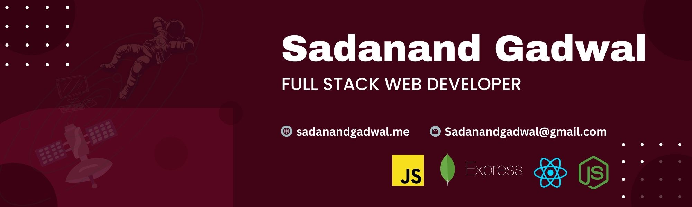

  

# 💫 About Me

🔭️ I Work on Javascript Tools like React & Express  🧑‍💻️ All my projects and experience are available at https://sadanandgadwal.me   💬️ Ask me about React | Javascript   📫 How to reach me Sadanandgadwal@gmail.com 

## 🌐 Socials:
      

